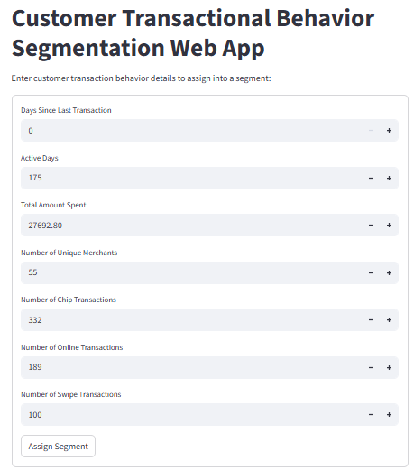
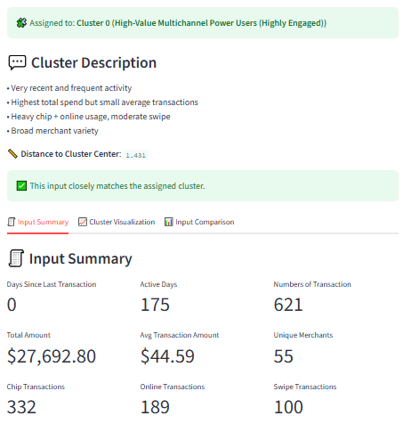
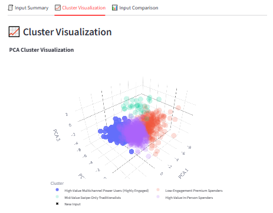
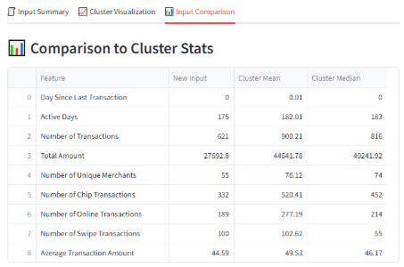

# Credit Card Customer Segmentation Based on Transactional Behavior

[](https://segmentation-webapp.streamlit.app/)

This is a Streamlit web application that classifies a credit card customer into one of four transactional behavior segments using a pre-trained KMeans clustering model. The app also provides visual insights and a side-by-side comparison to the cluster's average behavior.

---

## 🚀 Features

- ✅ Assigns customers to behavioral clusters
- 📏 Displays distance to the assigned cluster center (confidence level)
- 📈 Interactive 3D PCA visualization of all clusters
- 📋 Customer input summary
- 📊 Comparison table with cluster mean & median values

---

## 📊 Segment Definitions

| Cluster | Segment Name                                         |
| ------: | ---------------------------------------------------- |
|       0 | High-Value Multichannel Power Users (Highly Engaged) |
|       1 | Low-Engagement Premium Spenders                      |
|       2 | Mid-Value Swipe-Only Traditionalists                 |
|       3 | High-Value In-Person Spenders                        |

---

## 🖼️ Screenshots

|  |   |
| :----------------------------------: | :---------------------------: |
|         **Input Interface**          | **Segment Assignment Result** |

|  |  |
| :------------------------------------------------: | :------------------------------------------------: |
|             **Cluster Visualization**              |            **Cluster Comparison Table**            |

---

## 🌐 Live Demo

👉 Try it out here: [segmentation-webapp.streamlit.app](https://segmentation-webapp.streamlit.app/)

---

## 📁 Project Structure

```
├── main.py # Main Streamlit app
├── model config/
│ ├── kmeans_model.pkl
│ ├── pca_model.pkl
│ ├── robust_scaler.pkl
├── data/
│ ├── cluster_mean.csv
│ ├── cluster_median.csv
│ ├── pca_cluster_points.csv.csv
├── README.md
├── requirements.txt
```

---

## ⚙️ Requirements

It’s recommended to create a virtual environment before installing dependencies.

### 📦 Optional: Create and activate a virtual environment

```bash
# Create a virtual environment (optional but recommended)
python -m venv venv

# Activate the virtual environment
# On Windows:
venv\Scripts\activate
# On macOS/Linux:
source venv/bin/activate
```

Install required packages:

```bash
pip install -r requirements.txt
```

Run locally

```bash
streamlit run main.py
```

---

## 📌 Notes

- The clustering is based on 9 behavioral features such as:

  - Day Since Last Transaction
  - Active Days
  - Number of Transactions
  - Total Amount
  - Number of Unique Merchants
  - Number of Chip Transactions
  - Number of Online Transactions
  - Number of Swipe Transactions
  - Average Transaction Amount

- The PCA projection is used only for visualization (not clustering).

- Ensure your model config and summary files are available before running.

## 🧑‍💻 Author

- Built by Kong Rithrita
- Year 4 Data Science and AI Engineering student at CamTech University
- Thesis/Internship Project
